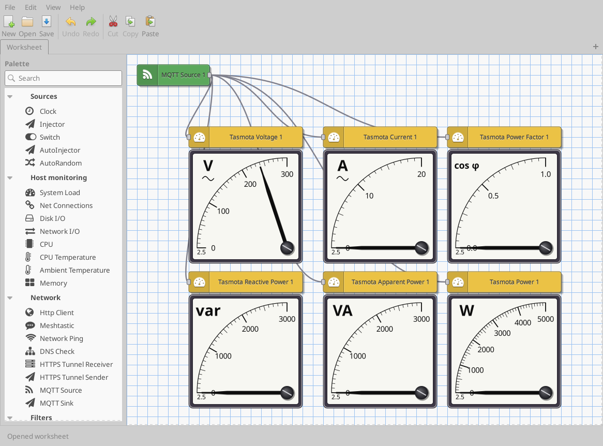
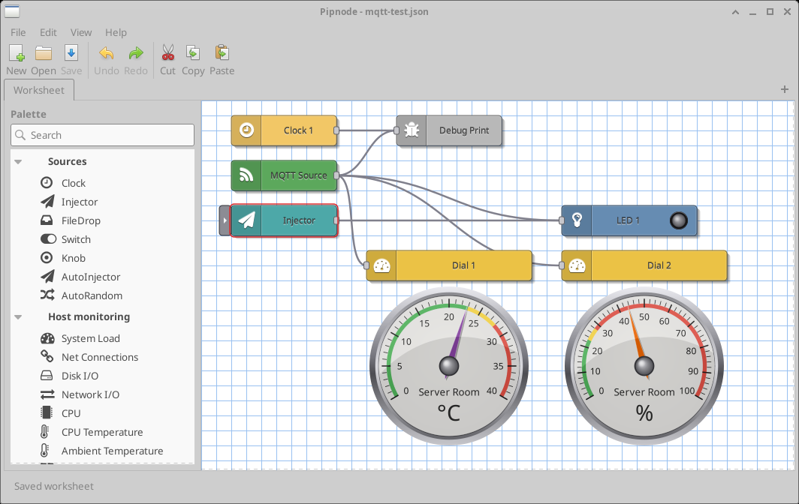
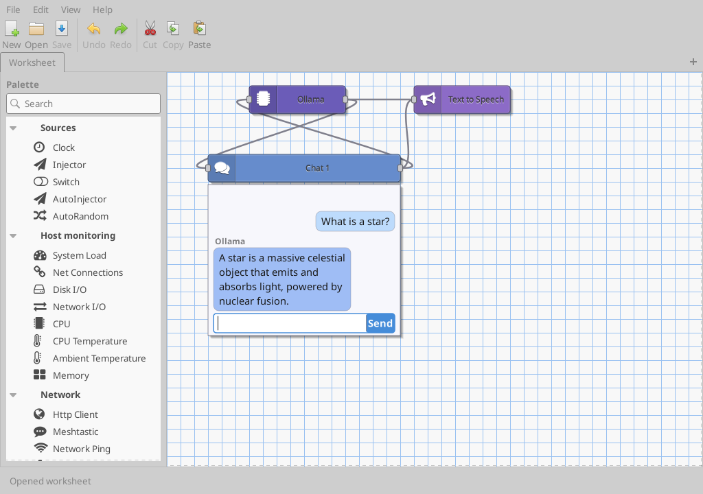
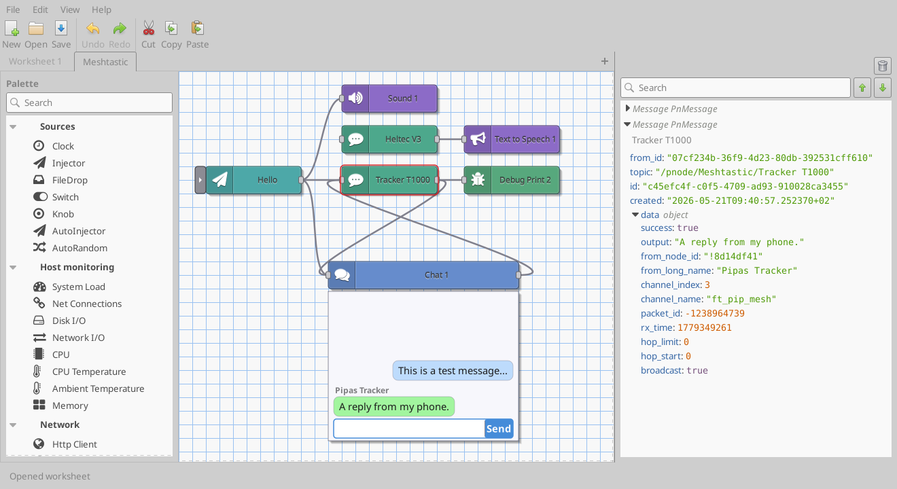

# Pipnode

A desktop visual flow editor for Linux, inspired by Node-RED. Drag nodes onto a
worksheet, wire them together, and build dataflows — network probes, MQTT,
sensors, gauges, image processing, LLM calls, and more — without writing glue
code. Pipnode is a native GTK 3 application written in C, with a first-class
plugin system so the node catalogue can grow without forking the core.



## Features

- Node-graph worksheets with live message flow, saved as plain JSON.
- A rich built-in node catalogue and bundled plugins (network, image,
  Tasmota, sound, shell, …).
- A dynamic **plugin system**: node types ship as `.so` modules loaded at
  start-up. Anyone can write plugins, and they can be open source *or*
  proprietary (see [Licensing](#licensing)).
- A debug view, expression/format/filter nodes, gauges and meters, and
  built-in per-node HTML help.

<p>
  
  
  
</p>

## Building

Pipnode uses GNU autotools:

```sh
autoreconf -fi
./configure
make
sudo make install        # optional
```

Main dependencies: GTK 3 (≥ 3.22), GLib/GModule, GtkSourceView 4, JSON-GLib,
libsoup 3, GnuTLS, PLplot, and libmosquitto; WebKit2GTK is optional. Exact
version requirements live in `configure.ac`, and `INSTALL` has notes on
optional voice/TTS data.

To build the sandboxed **Flatpak** community edition (a single-file bundle that
runs on any distro), see [`FLATPAK.md`](FLATPAK.md).

## Running headless (servers)

The editor (`pipnode-editor`) is the GTK application. A second binary,
`pipnode-run`, executes a saved worksheet **without the GUI** — load JSON,
run the flow, emit messages — so a worksheet can run on a server or under
cron/systemd:

```sh
pipnode-run my-flow.json            # run until interrupted
pipnode-run --timeout=30 my-flow.json
```

Pipnode is built as two libraries: a GTK-free **core** (`libpipnode-core`)
with the flow engine and all node logic, and a **GUI** tier
(`libpipnode-gui`) with the editor, canvas rendering and dialogs.
`pipnode-run` and `libpipnode-core` pull **no GTK at runtime**, so a host
with no display can execute flows. Bundled plugins are either core-only
(network, image, Tasmota) or two-tier — a headless logic `.so` plus an
editor-only `-gui.so` companion (shell, sound-effects) — so they install
and run on a server too. A distribution can therefore ship a `pipnode-core`
package with no GTK dependency alongside the full `pipnode-gui`; see
`INSTALL` for the packaging split and `PLUGINS` for writing
server-installable plugins.

## XFCE panel applets

A worksheet can also drive an **XFCE panel applet** — a button on the panel
that runs a flow and shows a value. The applet
(`panel-plugins/pipnode-worksheet`) is a thin D-Bus client linking **no**
pipnode library, so a node or plugin crash can never take down `xfce4-panel`.
The flow runs in a background **engine** — `pipnode-editor` started as a D-Bus
service (`--gapplication-service`, auto-activated on first use) — which holds
each worksheet in a hidden window whose flow ticks the whole time. Picking
**Properties** on the applet opens that *same running* worksheet for editing;
closing the editor autosaves and hides it, the flow keeps running.

Two core nodes bridge the flow to the panel: a **Panel Display** sink (its last
value is shown on the button, pushed live) and a **Panel Input** source (a
click drives it). A numeric Panel Display value is read as seconds remaining
and drawn on a tiny seven-segment **LED readout** as `ddd hh:mm:ss` — a
panel-sized echo of the Countdown node, refreshed live — while any other text
falls back to a plain label. The engine is the desktop-session
counterpart of the headless
`pipnode-run` server tool. The applet is built only when `libxfce4panel-2.0` is
present at configure time.

## Writing plugins

Plugins are the supported way to add node types (and, over time, other
extension kinds). The [`PLUGINS`](PLUGINS) guide walks through the ABI, the
loader, and how to build and install a plugin — a minimal one is about fifty
lines of C. Reference plugins live in `plugins/` and `tests/plugins/echo/`.

## Ideas & feature requests

Got an idea for a node or a feature? Open one on the
[**Ideas board**](https://github.com/laszlopere/pipnode/discussions/categories/ideas)
(GitHub Discussions) and 👍 the ones you'd like to see. It's a wishlist, not a
roadmap — every suggestion is read (sponsor input especially), but nothing there
is a promise.

## Licensing

Pipnode is **open core**:

- The **core** (`src/` + `lib/`) is **GPLv3-or-later, with the Pipnode Plugin
  Exception**. See [`LICENSE`](LICENSE), [`COPYING`](COPYING), and
  [`LICENSE.PLUGIN-EXCEPTION`](LICENSE.PLUGIN-EXCEPTION).
- **Plugins may use any license, including proprietary**, as long as they talk
  to pipnode through the documented plugin interface. The Plugin Exception
  makes this explicit — it applies to everyone, not just the project author.
- Some **premium plugins are distributed as sponsor-only binaries** (see
  below). The core never depends on them.

Contributions to the **core** require signing the
[Contributor License Agreement](CLA.md); see [`CONTRIBUTING.md`](CONTRIBUTING.md).
You do *not* need a CLA to publish your own plugin.

## Sponsorship

Pipnode is free and open source, and developing it takes real time. If it is
useful to you, please consider sponsoring the project. Higher sponsorship tiers
get access to **premium, closed-source plugins** (for example, plugins that
integrate with heavier backends such as MySQL/Galera). Sponsoring funds
continued development of the open core for everyone.

See the **Sponsor** button on the GitHub repository, or `.github/FUNDING.yml`.

## Copyright

Copyright (C) 2024-2026 Laszlo Pere. Licensed under GPLv3-or-later with the
Pipnode Plugin Exception.
